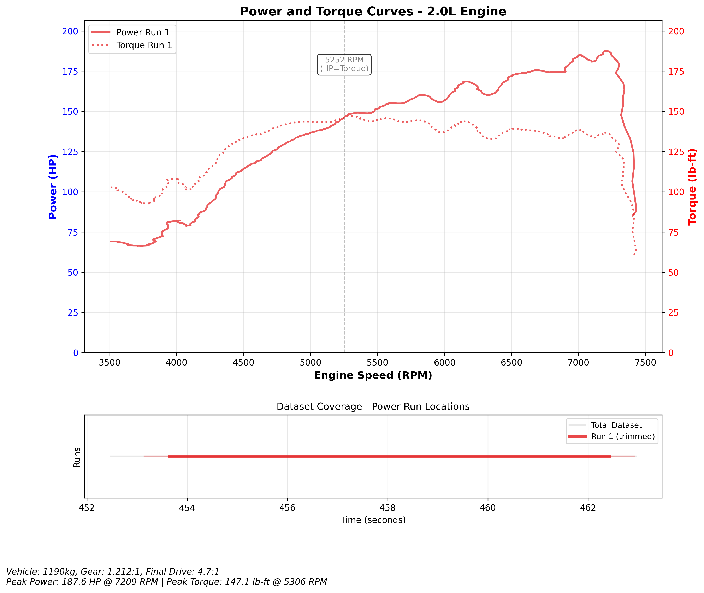

# Power Predictor

A tool for analyzing ECU log data to calculate power and torque curves, similar to a dynamometer. Inspired by Virtual Dyno but lacking all the testing, calibration and so on that that has (we think) undergone.

## Overview

This tool analyzes CSV logs from ECUs to determine power and torque by analyzing vehicle dynamics during wide-open-throttle (WOT) conditions. It uses acceleration data, vehicle weight, gearing, and tire specifications to calculate engine power and torque.

It is best used for comparing runs between tunes of the same vehicle on the same day, or for getting a 'picture' without needing to hire a dyno.



## How it ECU Logging works imperfectly

ECUs log as a secondary or tertiary downstream function for diagnosis, they do not log as a primary concern. This means that reported RPM is not necessarily realtime. Typically an ECU has dedicated physical hardware for firing injectors and spark plug coils and a miriad other things related to power train, emissions and safety. 

As such, the log at best is a blurry view of what the ECU was doing and cannot accurately show the time of an event, but rather a picture of the state of the engine in broad terms.

Using this broad data and with some load/wheel calculations, we can get an idea of the engine performance. The idea is that the logged ramp of RPM can be used to back-calculate the power generated - i.e. simply: for acceleration to continue at X rate with Y (load * wheel size * drive ratio * other parameters) it takes Z torque. Torque values are then converted to HP using standard formula.

## Limitations

- Inputs are only as good as outputs, setting up a dyno is not the same as performing logged runs on a flat straight road in a safe environment, remembering which gear was used, etc. You must gather a lot of accurate data to use this tool.
- Only works with G4X [the developer only has G4X ECUs] (but could be extended to others easily.)

## Features

- Filters data for WOT conditions (96-100% throttle) with stable-enough RPM increases
- Intelligent gap bridging to handle brief throttle/RPM fluctuations
- Configurable frame trimming to clean up start/end of power runs
- Calculates power (HP) and torque (lb-ft) from vehicle dynamics [parameters]
- Generates dyno-style graphs showing power and torque vs RPM
- Dataset coverage visualization showing which parts of the log were analyzed
- Supports multiple power runs in a single log file
- Configurable vehicle parameters (weight, gearing, tires, etc.)
- Advanced data filtering for problematic ECU readings [high/mixed frequency]

## Installation

1. Set up a virtual environment:
```bash
python3 -m venv venv
source venv/bin/activate
```

2. Install dependencies:
```bash
pip install pandas numpy matplotlib
```

## Usage

Basic usage with default Honda EP3 Type R specifications:
```bash
python power_predictor.py "your_log.csv"
```

With custom vehicle specifications:
```bash
python power_predictor.py "your_log.csv" \
  --weight 1200 \
  --occupant 100 \
  --final-drive 4.3 \
  --gear-ratio 1.000 \
  --displacement 2.0 \
  --cylinders 4 \
  --out power_curves.png
```

### Command Line Options

#### Vehicle Specifications
- `--weight`: Vehicle curb weight in kg (default: 998)
- `--occupant`: Occupant + gear weight in kg (default: 91)
- `--displacement`: Engine displacement in liters (default: 2.0)
- `--cylinders`: Number of cylinders (default: 4)

#### Drivetrain
- `--final-drive`: Final drive ratio (default: 4.7)
- `--gear-ratio`: Current gear ratio (default: 1.212 for EP3 Type R 4th gear)
- `--drivetrain-efficiency`: Drivetrain efficiency factor 0-1 (default: 0.85)

#### Tire Specifications
- `--tire-width`: Tire width in mm (default: 195)
- `--tire-sidewall`: Tire sidewall ratio in % (default: 50)
- `--tire-diameter`: Wheel diameter in inches (default: 15)

#### Vehicle Dynamics
- `--rolling-resistance`: Rolling resistance coefficient (default: 0.015)
- `--drag-coefficient`: Aerodynamic drag coefficient (default: 0.35)
- `--frontal-area`: Vehicle frontal area in m² (default: 2.5)

#### Data Processing
- `--smoothing-factor`: Data smoothing factor - 0 disables, higher values = more smoothing (default: 2.5)
- `--trim-frames`: Number of frames to trim from start/end of each run for cleaner data (default: 20)
- `--max-gap`: Maximum consecutive invalid samples allowed before ending a power run (default: 5)
- `--downsample-hz`: Downsample data to specified frequency in Hz (e.g., 50 for high-frequency ECU logs)
- `--no-hp-torque-correction`: Disable HP-Torque relationship correction (HP = Torque * RPM / 5252)
- `--no-rpm-filtering`: Disable RPM data filtering (keeps duplicate/bad ECU readings)

#### Analysis Parameters
- `--min-duration`: Minimum power run duration in seconds (default: 1.0)
- `--min-rpm-range`: Minimum RPM range for valid run (default: 2500)
- `--throttle-threshold`: Minimum throttle % for WOT detection (default: 96)

#### Output Options
- `--out`: Output file for the graph (optional)
- `--title`: Custom title for the plot
- `--no-plot`: Skip generating plot (text report only)
- `--debug`: Enable debug mode - output tabular data instead of graph
- `--debug-rpm-increment`: RPM increment for debug mode output (default: 250)

## CSV Format Requirements

The tool expects a CSV file with ECU log data containing these columns:
- `Section Time` - Timestamp
- `Engine Speed` - RPM
- `TPS (Main)` - Throttle position (%)
- `Driven Wheel Speed` - Vehicle speed (optional, will calculate from RPM if missing)
- `BAP` - Barometric pressure
- `IAT` - Intake air temperature
- `Lambda 1` or `Lambda Avg` - Air/fuel ratio data

## How It Works

1. **Data Loading & Cleaning**: 
   - Loads CSV data and cleans column names
   - Filters problematic RPM readings (duplicates, reversions)
   - Applies configurable data smoothing

2. **Power Run Detection**: 
   - Identifies periods where throttle position ≥ 99.5% and RPM is increasing steadily
   - Bridges brief gaps (up to 3 consecutive invalid samples) to merge continuous runs
   - Applies minimum duration and RPM range requirements

3. **Frame Trimming**: 
   - Removes configurable number of frames (default 20) from start/end of each run
   - Cleans up potentially unstable data at run boundaries
   - Maintains run detection but uses trimmed data for calculations

4. **Power & Torque Calculation**: 
   - Uses vehicle dynamics (F = ma) to calculate force required to accelerate the vehicle
   - Converts wheel force back to crankshaft torque using gear ratios
   - Applies estimates for rolling resistance, aerodynamic drag, and drivetrain efficiency
   - Enforces HP-Torque relationship (HP = Torque × RPM ÷ 5252) for physical accuracy

## Example Output

The tool generates:
- A text report with vehicle specifications and run summaries
- Power and torque curves plotted vs RPM
- Individual runs plus averaged curves if multiple runs are found
- Dataset coverage visualization showing which parts of the log were used for analysis
- Gap detection logging showing how data inconsistencies were handled

### Sample Analysis Results

**Honda EP3 Type R (Stock Setup):**
```
Run 1: 4369-6242 RPM, Max 219.8 HP @ 6191 RPM, 162.3 lb-ft @ 4412 RPM
Run 2: 6240-6775 RPM, Max 236.8 HP @ 6714 RPM, 166.7 lb-ft @ 6276 RPM
```

*Note: Power differences reflect changes in wheel diameter, weight, and rolling resistance.*

## Limitations

- Power calculations are estimates based on vehicle dynamics
- Requires accurate vehicle specifications for best results
- Rolling resistance and aerodynamic drag are simplified estimates
- Best accuracy when using actual wheel speed data vs calculated from RPM

## Default Vehicle Specifications

The tool defaults to Honda EP3 Type R specifications:
- Weight: 998 kg + 91 kg occupant
- Engine: 2.0L 4-cylinder
- 4th gear ratio: 1.212:1
- Final drive: 4.7:1
- Tires: 195/50R15

## Advanced Features

### Gap Bridging
The tool intelligently handles brief interruptions in power runs:
- Allows up to 3 consecutive invalid samples before ending a run
- Logs detected gaps and successful bridges
- Prevents single data points from splitting continuous runs

### Frame Trimming
Configurable trimming of run start/end improves data quality:
- Default: 20 frames trimmed from each end
- Removes potentially unstable acceleration/deceleration phases
- Coverage plot shows both detected runs (light) and trimmed data used (bold)

### Data Filtering
Advanced ECU data cleanup:
- Removes duplicate RPM readings with different timestamps
- Interpolates over RPM reversions during acceleration
- Applies Gaussian smoothing with configurable intensity