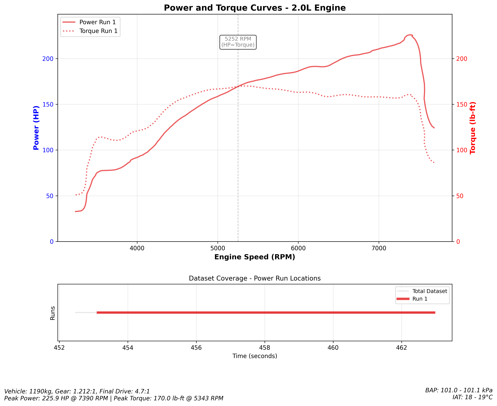
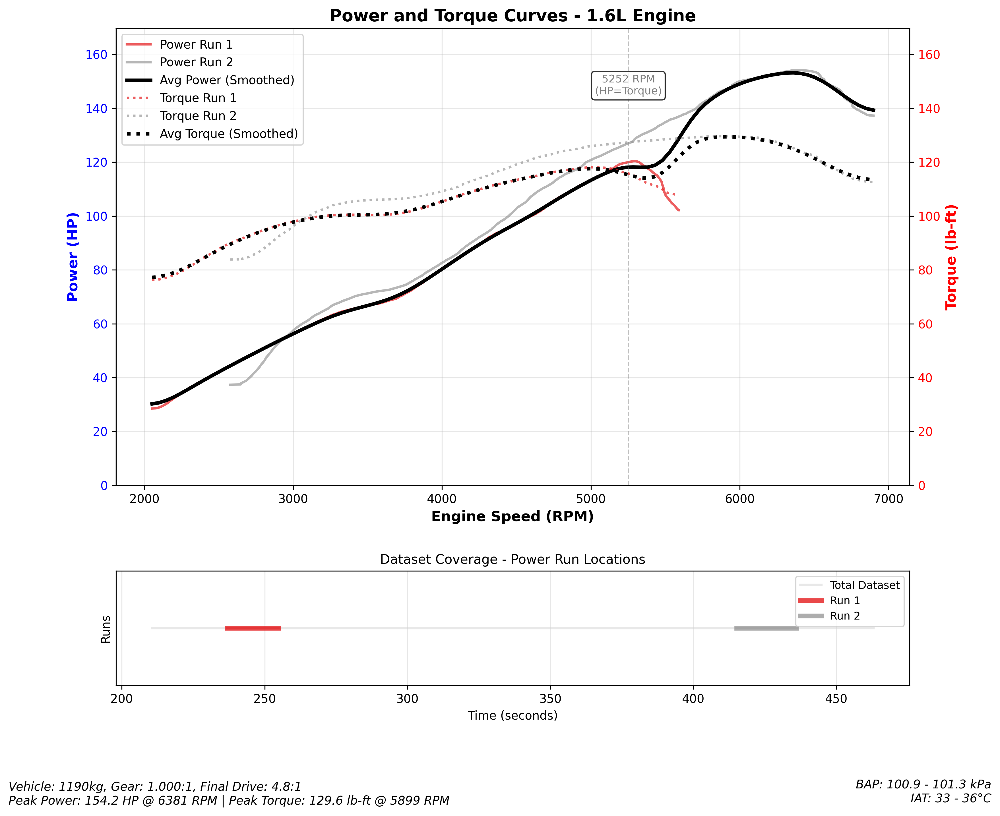

# Power Predictor

A tool for analyzing ECU log data to calculate power and torque curves, similar to a dynamometer. Inspired by Virtual Dyno [https://barnhill.bitbucket.io/] by Brad Barnhill [https://www.bradbarnhill.com/] but lacking all the testing, calibration and so on that that has (we hope) undergone.

ECU Logs Supported:
- G4X [the developer only has G4X ECUs]

ECU Logs Planned [Raise a PR and submit a Log!]:
- Haltech
- Megasquirt
- Hondata Kpro
- ME221
- [ Your ECU here if it supports CSV log output ].

## General Safety Warning

**1) You must drive your car safely and within the speed limits/driving conditions.**

**2) If given a choice, always choose safety over speed.**

**3) If in doubt, consider going to a dyno, it will be safer.**

**4) The author(s) of this code have warned you as above. We deny any responsibility for any damaged caused.**

## Overview

This tool analyzes CSV logs from ECUs to determine power and torque by analyzing vehicle dynamics during wide-open-throttle (WOT) conditions. It uses acceleration data, vehicle weight, gearing, and tire specifications to calculate engine power and torque.

It is best used for comparing runs between tunes of the same vehicle on the same day, or for getting a 'picture' without needing to hire a dyno.





## General Process to generate Run CSVs

Steps:

i. Warm your car up in the normal procedure, attach a laptop to your ECU (and start logging) or enable onboard logging.

ii. Perform one or more runs from around 2000rpm to redline.

**Tip:** For more accuracy/data, perform 2 runs in opposite directions of the same "flat, stragith, empty, safe" stretch of private track/airstrip/motorway. You can perform more runs...The more runs the better.

iii. Using a laptop or other device, Save/Export the log files as CSV files.

iv. Collate your vehicle data/gear ratios and other factors together per the [Usage] section.

## How ECUs log

ECUs log as a secondary or tertiary downstream function for diagnosis, they do not log as a primary concern. This means that reported RPM is not necessarily realtime. Typically an ECU has dedicated physical hardware for firing injectors and spark plug coils and a miriad other things related to power train, emissions and safety.

As such, the log at best is a blurry view of what the ECU was doing and cannot accurately show the time of an event, but rather a picture of the state of the engine in broad terms.

## How a log can simulate a power run

Using this broad data and with some load/wheel calculations, we can get an idea of the engine performance. The idea is that the logged ramp of RPM can be used to back-calculate the power generated - i.e. simply: for acceleration to continue at X rate with Y (load * wheel size * drive ratio * other parameters) it takes Z torque. Torque values are then converted to HP using standard formula.

### Mixed Frequency Logging

Some ECUs (the G4X, for instance) support mixed frequency onboard logging. One parameter might log at 1000hz and another might log at 50hz - based on just two parameters the will have, the 50hz parameters will be repeated in the log without change for 20 rows whereas each of these rows might have a different value for the 1000hz parameter.

## Limitations

- GIGO: Outputs are only as good as Inputs, setting up a dyno takes serious time, and is not the same as performing logged runs on a flat straight road in a safe environment, remembering which gear was used, precisely inputting all parameters. The more correct the inputs, the more potentially accurate become the outputs.
- Log should be made on a flat road without interruption. Any incline will reduce the graphed power. Any descent will increase the graphed power. Two runs on the same road in opposite directions may 'average out' gradient discrepancies.
- Some ECUs only log a change in RPM every time they process a cylinder 1 ignition event, or the CAM or Crank angle sensor fires again. The hardware side of the ECU will process the firing just fine but the software side (logging) is a secondary concern. Some ECUs may even log reversions in RPM even though this is not physically possible during a power run. This software aims to clean up the log.

## Features

- Filters data for WOT conditions (96-100% throttle) with stable-enough RPM increases
- Intelligent gap bridging to handle brief throttle/RPM fluctuations
- Configurable frame trimming to clean up start/end of power runs
- Calculates power (HP) and torque (lb-ft) from vehicle dynamics [parameters]
- Generates dyno-style graphs showing power and torque vs RPM
- Dataset coverage visualization showing which parts of the log were analyzed
- Supports multiple power runs in a single log file
- Configurable vehicle parameters (weight, gearing, tires, etc.)
- Advanced data filtering for problematic ECU readings [high/mixed frequency]

## Installation

1. Set up a virtual environment:
```bash
python3 -m venv venv
source venv/bin/activate
```

2. Install dependencies:
```bash
pip install pandas numpy matplotlib
```

## Usage

Basic usage with default Honda EP3 Type R specifications:
```bash
python power_predictor.py "your_log.csv"
```

With custom vehicle specifications:
```bash
python power_predictor.py "your_log.csv" \
  --weight 1200 \
  --occupant 100 \
  --final-drive 4.3 \
  --gear-ratio 1.000 \
  --displacement 2.0 \
  --cylinders 4 \
  --out power_curves.png
```

### Command Line Options

#### Vehicle Specifications
- `--weight`: Vehicle curb weight in kg (default: 998)
- `--occupant`: Occupant + gear weight in kg (default: 91)
- `--displacement`: Engine displacement in liters (default: 2.0)
- `--cylinders`: Number of cylinders (default: 4)

#### Drivetrain
- `--final-drive`: Final drive ratio (default: 4.7)
- `--gear-ratio`: Current gear ratio (default: 1.212 for EP3 Type R 4th gear)
- `--drivetrain-efficiency`: Drivetrain efficiency factor 0-1 (default: 0.85)

#### Tire Specifications
- `--tire-width`: Tire width in mm (default: 195)
- `--tire-sidewall`: Tire sidewall ratio in % (default: 50)
- `--tire-diameter`: Wheel diameter in inches (default: 15)

#### Vehicle Dynamics
- `--rolling-resistance`: Rolling resistance coefficient (default: 0.015)
- `--drag-coefficient`: Aerodynamic drag coefficient (default: 0.35)
- `--frontal-area`: Vehicle frontal area in m² (default: 2.5)

#### Data Processing
- `--smoothing-factor`: Data smoothing factor - 0 disables, higher values = more smoothing (default: 2.5)
- `--max-gap`: Maximum consecutive invalid samples allowed before ending a power run (default: 5)
- `--downsample-hz`: Downsample data to specified frequency in Hz (e.g., 50 for high-frequency ECU logs)
- `--no-hp-torque-correction`: Disable HP-Torque relationship correction (HP = Torque * RPM / 5252)
- `--no-rpm-filtering`: Disable RPM data filtering (keeps duplicate/bad ECU readings)

#### Analysis Parameters
- `--min-duration`: Minimum power run duration in seconds (default: 1.0)
- `--min-rpm-range`: Minimum RPM range for valid run (default: 2500)
- `--throttle-threshold`: Minimum throttle % for WOT detection (default: 96)

#### Output Options
- `--out`: Output file for the graph (optional)
- `--title`: Custom title for the plot
- `--no-plot`: Skip generating plot (text report only)
- `--debug`: Enable debug mode - output tabular data instead of graph
- `--debug-rpm-increment`: RPM increment for debug mode output (default: 250)

## CSV Format Requirements

The tool expects a CSV file with ECU log data containing these columns:
- `Section Time` - Timestamp
- `Engine Speed` - RPM
- `TPS (Main)` - Throttle position (%)
- `Driven Wheel Speed` - Vehicle speed (optional, will calculate from RPM if missing)
- `BAP` - Barometric pressure
- `IAT` - Intake air temperature
- `Lambda 1` or `Lambda Avg` - Air/fuel ratio data

## Technical Implementation

The power calculation follows these fundamental physics relationships:

**1. Vehicle Acceleration from RPM Data**
```
wheel_rpm = engine_rpm / (final_drive × gear_ratio)
vehicle_speed = wheel_rpm × tire_circumference × (π/30)
acceleration = d(vehicle_speed)/dt
```

**2. Force Requirements**
```
Force_total = Force_acceleration + Force_rolling + Force_aero
Force_acceleration = mass × acceleration
Force_rolling = mass × g × rolling_resistance_coefficient
Force_aero = 0.5 × air_density × drag_coefficient × frontal_area × speed²
```

**3. Power and Torque Calculation**
```
Power_watts = Force_total × vehicle_speed
Power_HP = Power_watts / 745.7
Wheel_torque = Force_total × tire_radius
Crank_torque = Wheel_torque / (final_drive × gear_ratio) / drivetrain_efficiency
Torque_lbft = Crank_torque × 0.7376
```

**4. Physical Validation**
The fundamental relationship HP = (Torque × RPM) / 5252 must hold true, where the curves naturally cross at 5252 RPM when both are calculated correctly from the same physical principles.
